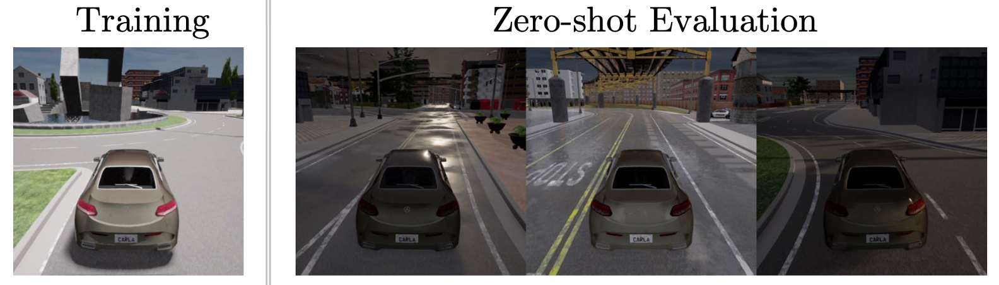

# CARLA Autonomous Driving Simulator

## Tasks


We construct a realistic driving scenario with visual observations in the CARLA simulator. The goal is to drive as far as possible along a figure-8 highway (CARLA Town 4) in 1000 time steps without colliding into 60 moving pedestrians or vehicles. The RGB observation is a 300-degree panorama of 84 × 420 pixels, formed by concatenating 5 cameras on the vehicle’s roof with 60-degree view each. The output action is a 2D vector of thrust (brake is negative thrust) and steering. 

The agents are trained at "clear noon", and evaluated on a variety of dynamic weather and lighting conditions at noon and sunset. For instance, the *wet* weathers feature roads with highly reflective spots. Averaged over 10 episodes per weather and 5 training runs, <b>SECANT</b> is able to drive <b>+47.7%</b> farther than prior SOTAs in tests.

## Installation

Download [CARLA 0.9.9.4](https://github.com/carla-simulator/carla/releases/tag/0.9.9) and install CARLA client.

```bash
mkdir carla
tar -xvzf CARLA_0.9.9.4.tar.gz -C carla
cd carla/PythonAPI/carla/dist
easy_install carla-0.9.9-py3.7-linux-x86_64.egg

# link the CARLA server to a system path
ln -fs carla/CarlaUE4.sh /usr/local/bin/carla-server

# [optional] if you get sound card errors, try this:
sudo echo 'pcm.!default { type plug slave.pcm "null" }' > /etc/asound.conf
```

Then launch the CARLA server by opening a terminal and running:
```bash
/usr/local/bin/carla-server -opengl
```
To force the simulator run off-screen, set the environment variable `DISPLAY` to empty and run:
```bash
DISPLAY= /usr/local/bin/carla-server -opengl
```

To specify a port other than the default one for distributed usage, run:

```bash
/usr/local/bin/carla-server -opengl --carla-world-port=your_port
```


## Usage

Use `secant.envs.carla.make_carla()` to create a standardized CARLA Gym environment with image observation modality.

Important Note:

1. Users can specify required observation modalities by, e.g., `modalities = ["rgb", "depth", "compass"]` then passing it to `secant.envs.carla.make_carla("town04", modalities=modalities)`. Use `secant.envs.carla.adapter.ALL_MODALITIES` to see all supported modalities. See this [doc](https://carla.readthedocs.io/en/latest/ref_sensors/) for detailed usages of each modality.

2. The created environment instance has properties `observation_space` and `action_space`. Please refer to OpenAI Gym's API. Don't forget to clamp your actions to fit the allowable `action_space`.

3. All supported weathers are recorded in `secant.envs.carla.ALL_WEATHERS`. They can be specified as a single string, for example, `"clear_noon"`.
