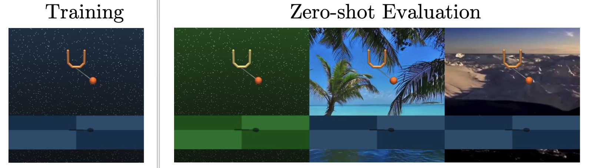

# Deepmind Control Suite

## Tasks


We follow the settings in [PAD](https://github.com/nicklashansen/policy-adaptation-during-deployment) and experiment with 8 tasks from DMControl. We measure generalization to (1) randomized colors of the background and robot itself, and (2) natural videos as dynamic background. <b>SECANT</b> significantly outperforms prior SOTA in all but one task, often by substantial margins up to <b>88.3%</b>.

## Installation

Please refer to [Installation](https://github.com/LinxiFan/SECANT#installation).

## Usage

Use `secant.envs.dm_control.make_dmc()` to create a standardized DMControl Gym environment with image observation modality. 

```python
from secant.envs.dm_control import make_dmc

env = make_dmc(
    task="walker_walk",
    background="original",
)
env.reset()

done = False
while not done:
    action = env.action_space.sample()
    obs, reward, done, info = env.step(action)    
```

Important Note:

1. `task` can be set to one of `["cheetah_run", "ball_in_cup_catch", "cartpole_swingup", "cartpole_balance", "walker_walk", "walker_stand", "finger_spin", "reacher_easy"]`
2. `background` can be set to one of `["original", "color_easy", "color_hard", "video[0-9]"]`.
3. The returned observation is a `uint8` numpy array of the image observation. Don't forget to scale it to floats between `[0., 1.)`

4. The created environment instance has properties `observation_space` and `action_space`. Please refer to OpenAI Gym's API. Don't forget to clamp your actions to fit the allowable `action_space`.

5. All supported tasks are recorded in `secant.envs.dm_control.ALL_TASKS`. They can be specified either as a tuple `("cartpole", "balance")` or as a single string `"cartpole_balance"`.
