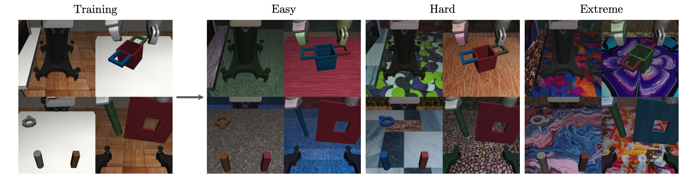

# Robosuite

## Tasks

We use the Franka Panda robot model with operational space control, and train with task-specific dense reward. All agents receive a 168×168 egocentric RGB view as input. The positions of moveable objects are randomized in each episode. 
* <b>Door opening</b>: a robot arm must turn the handle and open the door in front of it. 
* <b>Nut assembly</b>: two colored pegs (square and round) are mounted on the tabletop. The robot must fit the round nut onto the round peg. 
* <b>Two-arm lifting</b>: two arms on opposite ends must each grab a handle of a large pot and lift it up above certain height. 
* <b>Peg-in-hole</b>: one arm holds a board with a square hole in the center, and the other holds a long peg. Two arms must coordinate to insert the peg into the hole.

All agents are trained with clean background and objects, and evaluated on 3 progressively harder sets of environments. We design 10 variations for each task and difficulty level, and report the mean reward over 100 evaluation episodes (10 per variation). <b>SECANT</b> gains an average of <b>+287.5%</b> more reward in easy set, <b>+374.3%</b> in hard set, and <b>+351.6%</b> in extreme set over the best prior method.

## Installation

Please refer to [Installation](https://github.com/wangguanzhi/secant-private#installation).

## Usage

Use `secant.envs.robosuite.make_robosuite()` to create a standardized Robosuite Gym environment. 

```python
from secant.envs.robosuite import make_robosuite

env = make_robosuite(
    task="Door",
    mode="train",
    scene_id=0,
)
env.reset()

done = False
while not done:
    action = env.action_space.sample()
    obs, reward, done, info = env.step(action)    
```

Important Note:

1. `task` can be set to one of `["Door", "TwoArmPegInHole", "NutAssemblyRound", "TwoArmLift"]`.
2. `mode` can be set to one of `["train", "eval-easy", "eval-hard", "eval-extreme"]`.
3. `scene_id` is `0` for the training mode and is in a range of `0` to `9` for the evaluation mode.
4. Robosuite supports both image and robot state modality. Pass in `["rgb"]` or `["state"]` to `obs_modality` to turn on either mode, 
    or pass in `["rgb", "state"]` to turn on both. 
   
   For image modality, robosuite supports different view points such as `frontview`, `sideview`, `birdview`, `agentview`, `robotview` and `eye_in_hand`. 
   To control which view(s) that the environment returns, pass in the name(s) of the desired views to `obs_cameras`. Ex. `obs_cameras=["agentview", "frontview"]`.
   
5. The created environment instance has properties `observation_space` and `action_space`. Please refer to OpenAI Gym's API. 
Because both rgb and state modality are supported, the observation space is a dictionary of `gym.Box` objects rather than a single `gym.Box`
   object. Observation should have the form `{"rgb": {"frontview": np.array, "sideview": np.array}, "state": np.array}` if multiple views are requested or
   `{"rgb": np.array, "state": np.array}` if only one view is requested.

6. Set `headless=True` if no human rendering is needed. Use `render_camera` to set the camera name to use when `env.render()` is called. 
Note that when image modality is turned on, `render_camera` has to be included in `obs_cameras`.
